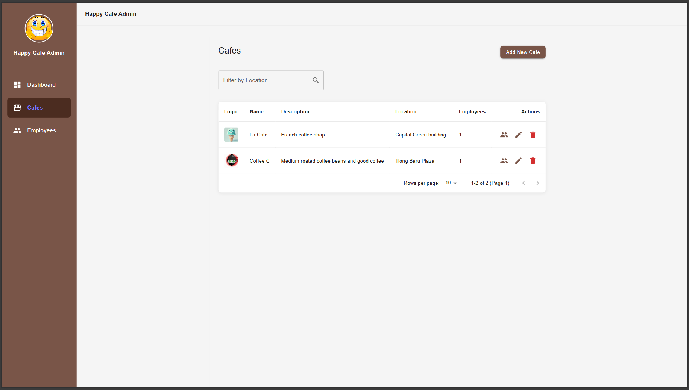

# Happy Cafe Admin (Experimental)

A full-stack application for managing cafe administration.
This branch has a testing feature of mapping API keys.
### A full-stack application for managing cafes and administration.  
The application used .Net 9 for backend and React 19 for frontend.

## Project Structure

- `frontend/`: React application with TypeScript
- `backend/`: .NET API application

## Development Setup

### Prerequisites

- Node.js v22.14.0
- .NET 9.0.201 SDK
- npm
- Docker 

### Preparation

#### Make sure docker is running before we do the following steps:

1. Go to \setup_dev from the project <root> directory

2. Create .env files with the following format.

2. Create .env files with the following format. An example is provided.
```bash 
# Database Configuration
DB_HOST=localhost
DB_PORT=5432
DB_USER=<username>
DB_PASSWORD=<password>
DB_NAME=<db_name>

# File Storage Configuration
FILE_STORAGE_ROOT_PATH=
FILE_STORAGE_PATH=FileStore
FILE_STORAGE_LOGOS_PATH=FileStore/logos
FILE_STORAGE_MAX_SIZE=2097152

#APIKey
Authentication__ApiKey=
```
3. Go to \backend\frontend Folder.

4. Create .env file with following format.
```bash
VITE_BACKEND_API_URL=http://localhost:5222
VITE_MODE=development
VITE_API_KEY=
```
5. Run the docker-compose to create DB in Postgres. 

3. Run the docker-compose to create DB in Postgres. 
```bash
docker-compose up -d
```

6. Run the following to add migrations and seed the data from <Root>\backend\DataAccess
4. Run the following to add migrations and seed the data from <Root>\backend\DataAccess after Postgres DB container is up and running.
```bash
dotnet tool install --global dotnet-ef # if you haven't installed ef tool
dotnet ef migrations add SeedData # this will create migrations files under DataAccess/Migrations
dotnet ef database update # to create, DB schemas and constraints in Postgres
```

### Running the Application

Before you run. Go to project <Root> directory, and run 

```bash
npm i
```

This will install required node_modules to run both backend and frontend simultaneously.


#### Option 1: Run Both Frontend and Backend concurrently after installing node_modules in the front-end project.

```bash
npm run start
```

#### Option 2: Run Frontend and Backend Separately

To run only the frontend:

```bash
npm run frontend # need to install node_modules in front-end first.
```

To run only the backend:

```bash
npm run backend
```

## Additional Information

- Frontend runs on: http://localhost:5173
- Backend API runs on:  http://localhost:5222

### Note: This is experimental branch. 

API key will be dynamically geenerated for both front-end and backend when we click a button to genereate the API key from Dev Setting in the UI. 

## Examples

### Cafe Overview Page


### Employee Overview Page


### Cafe Add or Edit


### Employee Add or Edit


### Cafe Delete Alert


### Employee Delete Alert


### API Key Generate

